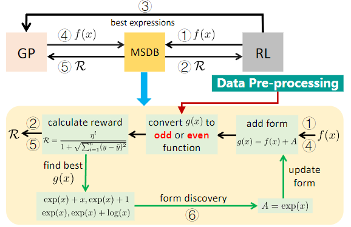
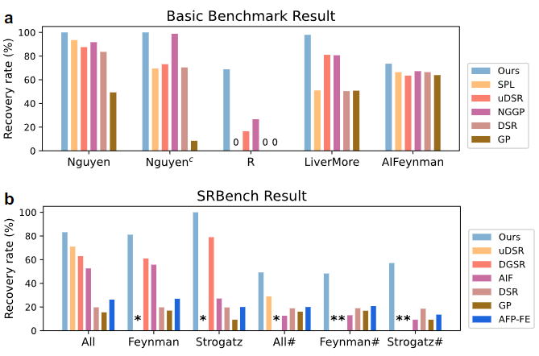

# RSRM

code of ICLR 2024 paper Reinforcement Symbolic Regression Machine [RSRM](https://openreview.net/pdf?id=PJVUWpPnZC) 

## Introduction



Reinforcement Symbolic Regression Machine (RSRM) is a machine to uncover complex math equations from only scarce data. The RSRM model is composed of three key modules: 

(1) a Monte Carlo tree search (MCTS) agent, designed for exploration, that explores optimal math expression trees consisting of pre-defined math operators and variables, 
(2) a Double Q-learning block, designed for exploitation, that helps reduce the feasible search space of MCTS via properly understanding the distribution of reward,
(3) a modulated sub-tree discovery block that heuristically learns and defines new math operators to improve representation ability of math expression trees. 

Binding of these modules yields the SOTA performance of RSRM in SR as demonstrated by multiple benchmark datasets



Recover rates of benchmark datasets. a, Basic benchmarks. b, SRbench dataset , where the symbol # denotes the presence of noise with a mean of 10−3 added to the target values and ∗ represents missing data in the literature.

## Dependencies

+ python==3.8
+ numpy==1.21.5
+ pandas==1.4.1
+ scipy==1.8.0
+ sympy==1.10.1
+ deap==1.3.3

or just `pip install -r requirements.txt`

**It is not recommended to change the versions of the last three items.**

## Usage

see `demo/demo.py` or use `main.py` as 

````bash
python main.py --task nguyen/1 --num_test 100 --json_path config/config.json --output output/ --threshold 1e-10
````

## Cite

If you want to use our codes in your research, please cite:

```
@inproceedings{
Xu2024reinforcement,
title={Reinforcement Symbolic Regression Machine},
author={Yilong Xu, Yang Liu, Hao Sun},
booktitle={The Twelfth International Conference on Learning Representations},
year={2024},
url={https://openreview.net/forum?id=PJVUWpPnZC}
}
```

